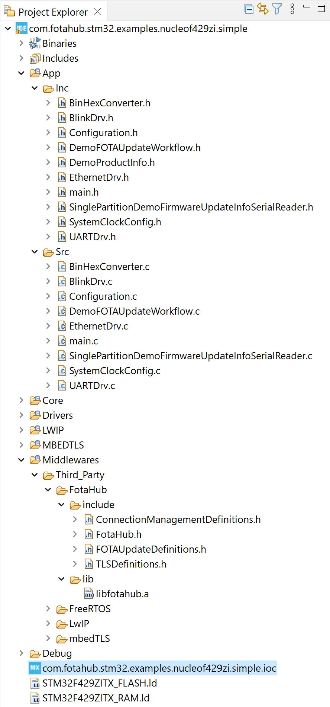
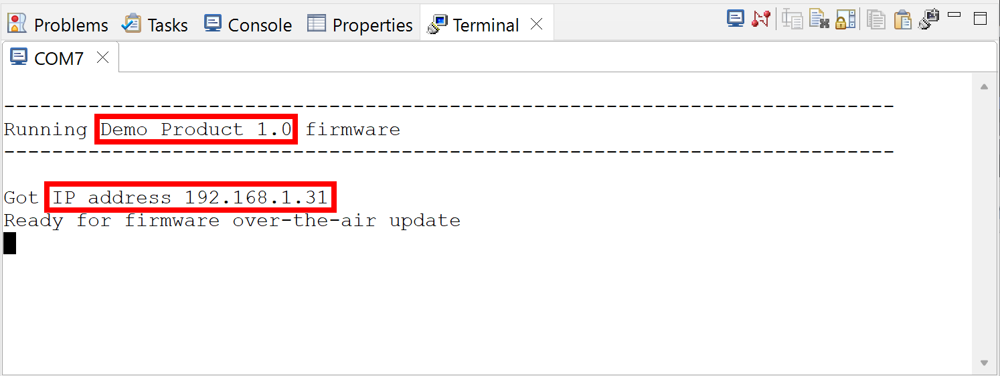
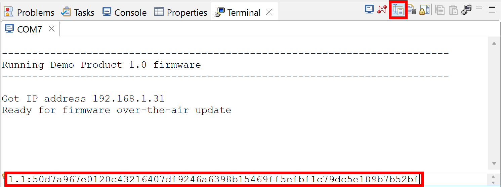
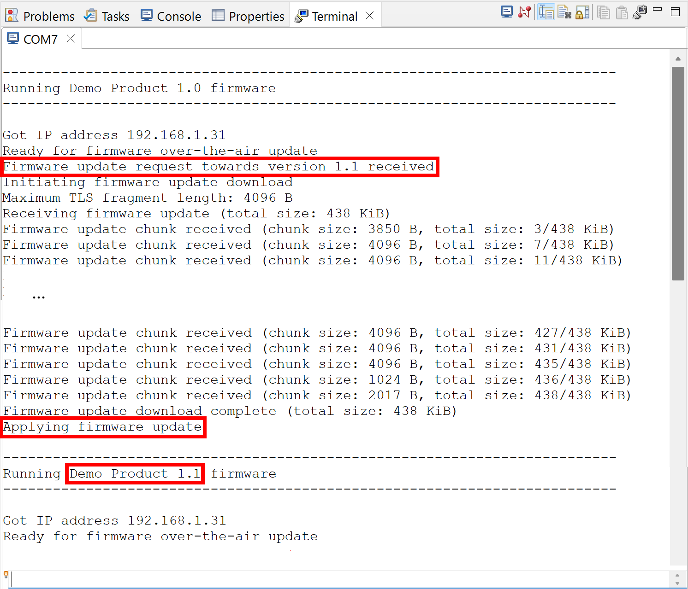

# Simple FOTA update example

The *Simple* example demonstrates the most straight forward manner to make firmware over-the-air updates with FotaHub. It is kind of a "Hello World" example for FOTA updating and a perfect way to get started in that field.

## Operating principle

The device listens for a firmware update info string to be sent over the serial port. It is expected to consist of the new firmware version the device should be updated to followed by a ':' separator and the checksum or signature of the new firmware version:

`<new-version>:<verification-data>` 

For example:

`1.1:a15d5599d8745ff4f51690eb3996afcf75d0b1729d1b8cda2491b03940417521`

Once a valid update info string has been received and the contained new firmware version is different from the version of the firmware already running on the device, the firmware update procedure is triggered. It involves the device to connect to FotaHub and download the binary of the new firmware version. Thereby, it uses a dedicated URL including the id of the product representing the device in FotaHub, and the name and the version of the firmware binary to be retrieved, e.g.:

`https://bin.fotahub.com/7f52cf5e-7f0d-49dc-87fd-679ebfb94d8d/DemoProduct-1.1`

The downloaded firmware binary is stored in the device's flash memory. At the same time, the downloaded firmware binary's checksum or signature is recalculated and compared to the checksum or signature included in the previously communicated update info string. If both match, the firmware update is applied by restarting the device and letting it boot into the flash memory partition where the downloaded firmware binary has been stored. After the restart, the device executes the new firmware version downloaded from FotaHub. 

## Supported targets

The Simple example can be used as is with any of the following development boards:
* [STM32 Nucleo-F429ZI development board](https://www.st.com/en/evaluation-tools/nucleo-f429zi.html)
* [STM32 Nucleo-F767ZI development board](https://www.st.com/en/evaluation-tools/nucleo-f767zi.html)

With some adaptations, it can also be used with any other STM32-based board or hardware product provided it features an on-board Ethernet network interface or a wireless Wi-Fi adapter.

## Installation

A description of the SDKs and tools that must be available on your laptop or computer and advise how to install them can be found [here](../../README.md#installation).

## Usage

### Create a FotaHub product

Create a FotaHub product that represents your board in FotaHub as explained [here](../fotahub/create-product.md). It will be used to upload and provide firmware updates for the same. 

### Get the FotaHub Device SDK for STM32

If not yet done so, either clone or download and uncompress the [FotaHub Device SDK for STM32](https://github.com/fotahub/fotahub-device-sdk-stm32) to a location of your choice on your machine. 

### Create and run initial firmware version

1. Start the STM32CubeIDE and select a directory of your choice as workspace. Close the `Information Center` page that shows up when you start the STM32CubeIDE for the first time. Be sure that the required plugins as described [here](../fotahub/create-product.md) are installed.

2. Import (`File` > `Import...` > `General` > `Existing Projects into Workspace`) the `com.fotahub.stm32.examples.<board-name>.simple` project matching your board from the `examples` folder of the FotaHub Device SDK for STM32.

3. Open the `com.fotahub.stm32.examples.<board-name>.simple.ioc` file located inside the imported project by double clicking it.

    > &#x26A0; In case you get notified that there are newer STM32CubeMX and STM32Cube firmware versions available than those with which the project has been set up initialiy, choose to stay compatible with the old versions by clicking on the `Continue` button.

4. Pull the required STM32Cube MCU and middleware packages as well as the FotaHub middleware package into the project by running the device configuration tool code generation (`Project` > `Generate Code`). Upon successful completion of this step, your project should look something like this:

    

5. Open the `DemoProductInfo.h` file in the `App/Inc` folder, and initialize the `DEMO_PRODUCT_ID` and `DEMO_PRODUCT_NAME` constants with the id and the name of the previously created FotaHub product (see `Products` > `{{Your FotaHub product}}` > `Settings` > `General` at [Fotahub](https://fotahub.com)). Leave the `DEMO_PRODUCT_FIRMWARE_VERSION` as is for now. In case you have selected anything else than `SHA256` as the binary checksum algorithm for your FotaHub product or opted for using a signature instead, you also must adjust the `DEMO_PRODUCT_FIRMWARE_UPDATE_VERIFICATION_ALGORITHM` constant accordingly:

    ```c
    #define DEMO_PRODUCT_ID "7f52cf5e-7f0d-49dc-87fd-679ebfb94d8d"

    #define DEMO_PRODUCT_NAME "Demo Product"

    #define DEMO_PRODUCT_FIRMWARE_VERSION "1.0"

    #define DEMO_PRODUCT_FIRMWARE_UPDATE_VERIFICATION_ALGORITHM FOTA_UPDATE_VERIFICATION_ALGORITHM_SHA256
    ```

6. Set `Release` as active configuration for the project (`Project` > `Build Configurations` > `Set Active` > `2 Release`) and build it (`Project` > `Build Project`).
    
7. Connect your board to your laptop or computer using a USB cable which you need to plug into the USB connector (`CN1`) on the ST-LINK debugger/programmer part at the upper end of the board. Next, connect your board to a router, repeater or switch using an Ethernet cable that you must plug into the RJ45 connector (`CN14`) at the lower end of the board. Finally, flash and run the firmware binary resulting from previous step on the board (`Run` > `Run`).
   
8. Open the `Terminal` view (`Window` > `Show View` > `Other...` > `Terminal` > `Terminal`). Click on the `Open a Terminal` button in the view's toolbar, and choose  `Serial Terminal`. Select the serial port your board is connected to (if multiple serial ports are offered for selection read [here](https://docs.espressif.com/projects/esp-idf/en/latest/esp32/get-started/establish-serial-connection.html#check-port-on-windows) to find out which of them is applicable when working under Windows), and set the baudrate to `115200`. Click on `OK` to open the serial port. Then, press the reset button (`B2`) in the lower right corner of your board, observe how the firmware starts up and verify whether it connects to your local network:

    

    Also have a look at the green LED (`LD1`) at the upper end of the main part of your board. It should blink with a period of approx. 1 s.

### Create and upload a new firmware version to FotaHub

1. Go back to the `DemoProductInfo.h` file in the `App/Inc` folder, and bump the `DEMO_PRODUCT_FIRMWARE_VERSION` constant:

    ```c
    #define DEMO_PRODUCT_FIRMWARE_VERSION "1.1"
    ```

2. *Optional:* Make another change in your firmware, e.g., increase the blink frequency of the green LED (`LD1`) on your board by going to the `Configuration.h` file in the `App/Inc` folder and decreasing the `BLINK_PERIOD` constant:

    ```c
    #define BLINK_PERIOD 250
    ```

3. Make sure that `Release` is still set as active configuration for the project (`Project` > `Build Configurations` > `Set Active` > `2 Release`) and rebuild it (`Project` > `Build Project`). Locate the resulting new firmware binary file named `com.fotahub.stm32.examples.<board-name>.simple.elf` in the `Binaries` folder of your project (using the `Project Explorer` view).
   
    > &#x1F6C8; You can locate the new firmware binary file also in your file system explorer by using the corresponding context menu action (`Show In` > `System Explorer`). This can come quite handy in the subsequent steps. 

4. Upload the new binary (`com.fotahub.stm32.examples.<board-name>.simple.elf`) as firmware version `1.1` to your FotaHub product as explained [here](../fotahub/upload-firmware.md).

### Make your first firmare over-the-air update 

1. Go back to the `Terminal` view showing the execution status of your board running the initial firmware version. Click on the `Toggle Command Input Field` button in the view's toolbar. A text field enabling you to enter and send data over the opened serial port appears at the lower end of the `Termianl` view. Enter the new firmware version followed by a ':' separator, the checksum or signature of the same (see `Products` > `{{Your FotaHub product}}` > `Details` > `{{New firmware version}}` at [Fotahub](https://fotahub.com)):

     

2. Submit the firmware update info string to your board by hitting the `ENTER` key. This will trigger the firmware over-the-air update procedure. Upon successful completion, the board will be restarted with the new firmware version downloaded from FotaHub. To verify that, check the firmware version in the banner showing up in the `Terminal` view output:

     

    In case that the new firmware version includes the change wrt to the blink frequency of the green LED (`LD1`) on your board as mentioned above, you should also see that the latter is blinking significantly faster now.