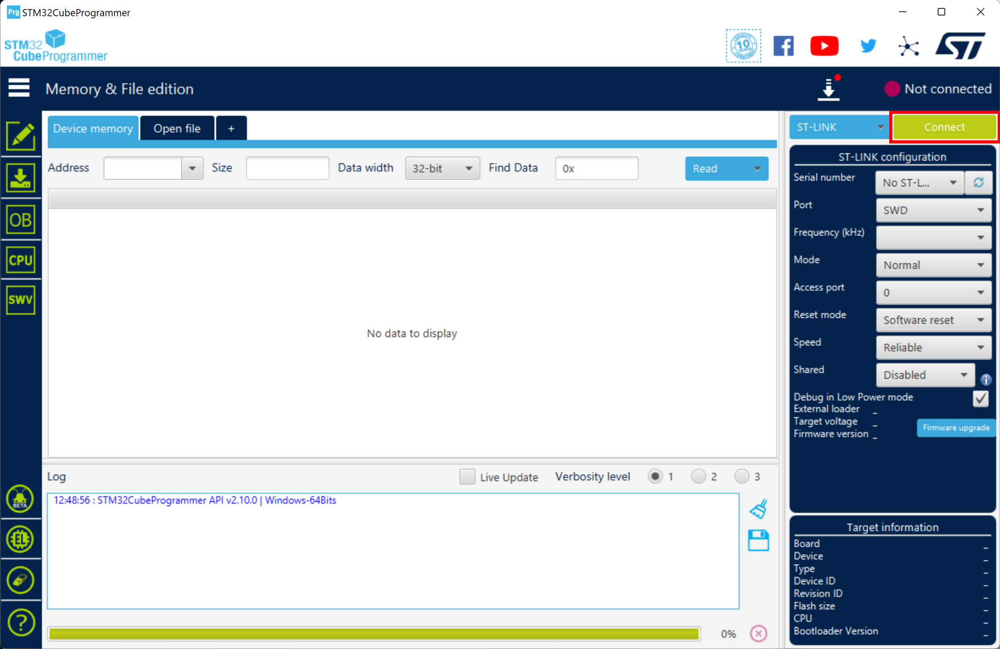
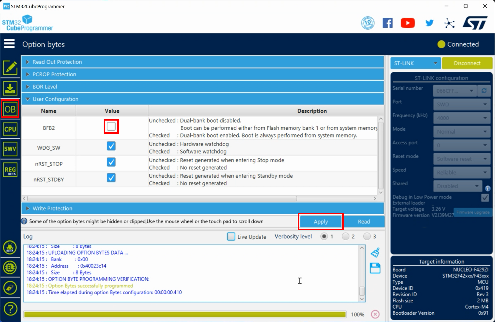

# How to get your board's boot sequence ready for firmware over-the-air updating

1. Connect your board to your laptop or computer using a USB cable which you need to plug into the USB connector (`CN1`) on the ST-LINK debugger/programmer part at the upper end of the board.

2. Start the STM32CubeProgrammer, and click on the `Connect` button in the upper right area of the tool window:

    

3. Go to the option byte settings panel by clicking on the `OB` icon figuring on the left side of the tool window. Uncheck the `BFB2` setting and click on `Apply`:

    
